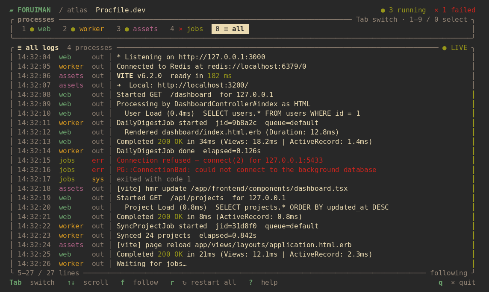

# Foruiman

[](https://github.com/Nuzair46/foruiman/actions/workflows/ci.yml)



A modern Procfile runner with process tabs, bounded logs, scrolling, and isolated
restarts. Foruiman is a fork of [Foreman](https://github.com/ddollar/foreman) and
retains its MIT license.

Requires Ruby 3.2+ and a POSIX system. CI covers Ruby 3.2, 3.3, 3.4, and 4.0 on Linux.

## Install

```sh
gem install foruiman
```

## Run

Create a `Procfile`:

```procfile
web: bundle exec rails server -p "$PORT"
worker: bundle exec sidekiq
css: yarn build:css --watch
```

Then start Foruiman:

```sh
foruiman
```

Useful commands:

```sh
foruiman start -f Procfile.dev  # use another Procfile
foruiman start web              # run one process
foruiman start --no-tui         # stream plain logs
foruiman check                  # validate without starting
foruiman --version
```

The TUI opens when stdin and stdout are terminals. Otherwise, Foruiman streams
plain logs and exits when the processes finish. Processes run independently, and
restarting one process does not interrupt the others.

## Options

| Option | Default | Purpose |
| --- | --- | --- |
| `-f`, `--procfile FILE` | `Procfile` | Procfile to run |
| `-d`, `--root DIR` | Current directory | Working directory |
| `-e`, `--env FILE` | None | Additional environment file |
| `--no-dotenv` | `.env` enabled | Skip `.env` |
| `-p`, `--port PORT` | `5000` | Base port; entries increment by 100 |
| `--log-lines N` | `10000` | Retained records per process and in `all` |
| `--no-tui` | TUI when interactive | Force plain output |

## Keyboard

| Key | Action |
| --- | --- |
| Tab / Shift-Tab, Left / Right, `h` / `l` | Change tab |
| `1`–`9`, `0` | Select a process or `all` |
| Up / Down, `k` / `j` | Scroll |
| PageUp / PageDown, Ctrl-U / Ctrl-D | Scroll a page |
| Home / `g` | Jump to oldest retained log |
| End / `G` / `f` | Follow new output |
| Space | Pause or resume following |
| `r` | Restart the selected process, or all from `all` |
| `R` | Restart all processes |
| `s` / `S` | Stop selected / stop all |
| `?` / Escape | Toggle help / close help |
| `q` / Ctrl-C | Stop processes and quit |

## Documentation

- [Rails usage](docs/RAILS.md)
- [Architecture and supervisor API](docs/ARCHITECTURE.md)
- [Differences from Foreman](docs/COMPATIBILITY.md)

## Development

```sh
bundle install
bundle exec rspec
bundle exec rubocop
gem build foruiman.gemspec
bundle exec ruby script/smoke_gem.rb
```

## Release

Releases use RubyGems trusted publishing. Configure the publisher once with
repository `Nuzair46/foruiman`, workflow `release.yml`, and environment `release`.

To publish, update `lib/foruiman/version.rb` on `main`, open the
[Release workflow](https://github.com/Nuzair46/foruiman/actions/workflows/release.yml),
choose **Run workflow**, and select `main`. GitHub Actions runs the full CI suite,
creates the version tag, and publishes the gem to RubyGems.org.
